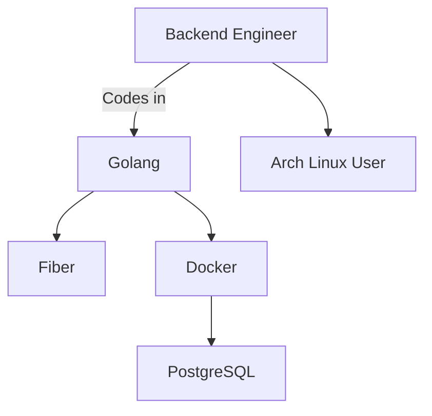

  

  
  
  

---

<h2 align="center">About Me</h2>

  

I'm passionate about server-side development, creating flexible APIs, and exploring new ways to solve complex problems. I could say it, but we all know it's a lie, and some of it's not. Think by yourself. 

---

<h2 align="center">Tech Stack</h2>

  

<ul align="center">
  <li><b>Languages:</b> Golang</li>
  <li><b>Frameworks:</b> Fiber</li>
  <li><b>Tools:</b> Docker, PostgreSQL</li>
  <li><b>OS:</b> Arch Linux (btw)</li>
</ul>

---

<h2 align="center">Featured Project</h2>

  

---

<h2 align="center">Find Me Here</h2>

  
  
  

---

<h2 align="center">Random shit</h2>

  Linux taught me the art of building things from scratch. 
  Windows taught me the importance of a backups... and how to reinstall OS every month 

---

  
  
   
  

---

  

